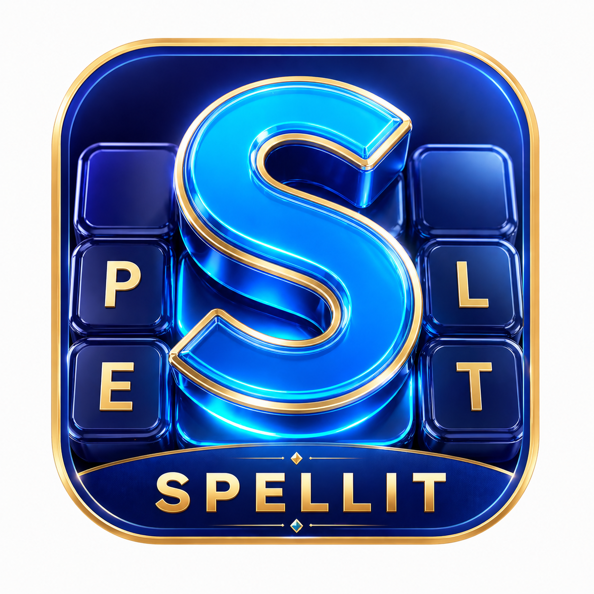
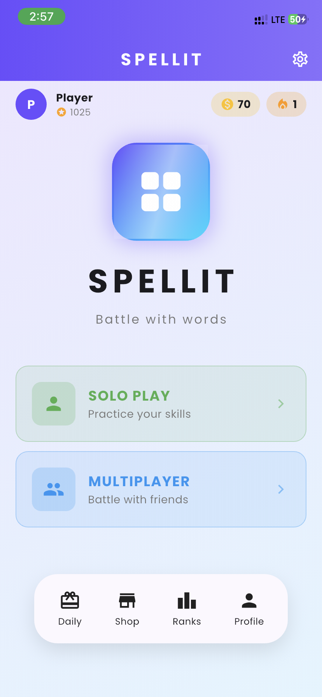
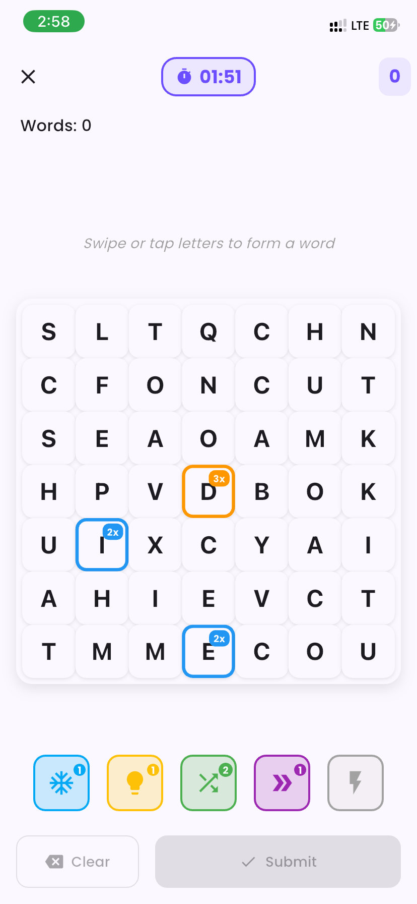
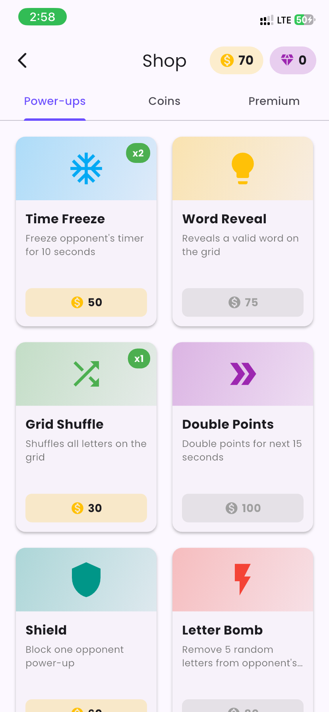
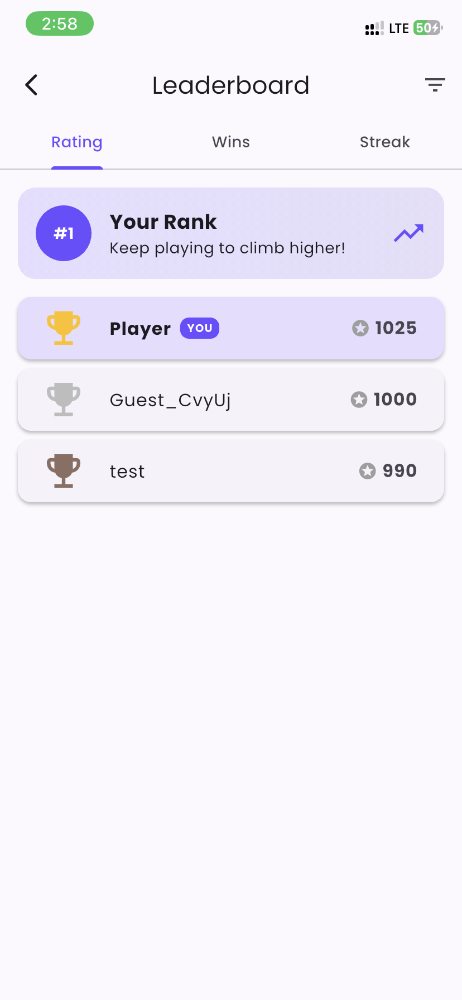
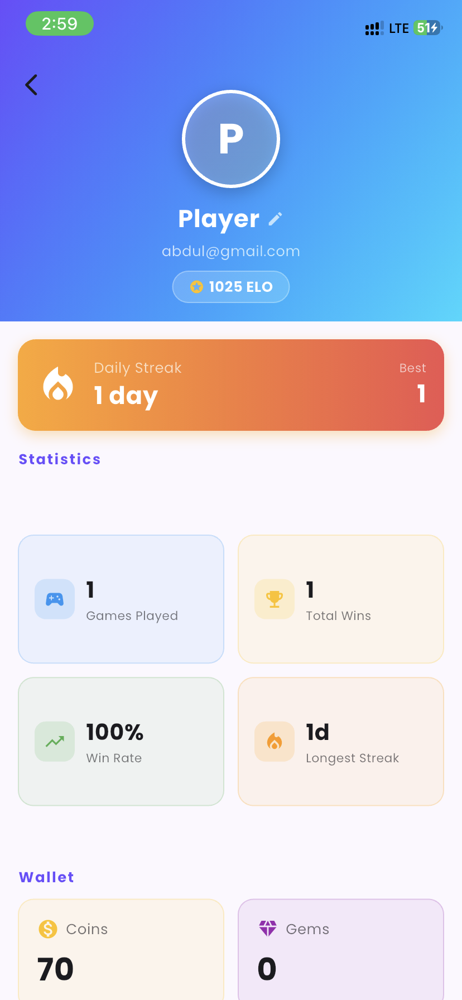
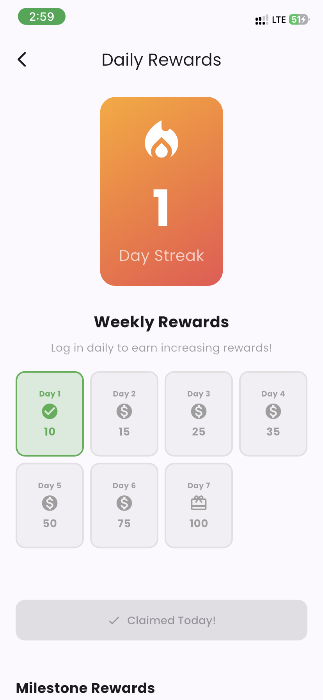

<p align="center">
  
</p>

# SpellIt | Conquer the Grid 🛡️⚡

**SpellIt** is a fast-paced, real-time multiplayer word battle game built with Flutter and Firebase. Challenge your vocabulary, use strategic power-ups, and climb the global leaderboard in 2-minute PvP duels.

[](https://flutter.dev)
[](https://firebase.google.com)
[](https://opensource.org/licenses/MIT)

---

## 🎮 Gameplay Features

### ⚔️ Real-Time PvP Battles
Engage in intense 2-minute word duels. Tap letters on the grid to form words and damage your opponent. The more complex the word, the higher the damage!

### 🧪 Strategic Power-ups
Turn the tide of battle with unique power-ups:
- **Freeze**: Lock your opponent's grid for a few seconds.
- **Shield**: Protect yourself from incoming damage.
- **Bonus**: Double your score for the next word.

### 🏆 Ranked Seasons
Compete in the live Global Leaderboard. Earn exclusive badges and climb from Bronze to Legend each season.

---

## 📸 Screenshots

<p align="center">
  
  
  
</p>
<p align="center">
  
  
  
</p>

---

## 🚀 Getting Started

### Prerequisites
- [Flutter SDK](https://docs.flutter.dev/get-started/install) (v3.0.0+)
- [Firebase Account](https://console.firebase.google.com/)

### Installation

1. **Clone the repository:**
   ```bash
   git clone https://github.com/misterbrown3404/spellit.git
   cd spellit
   ```

2. **Install dependencies:**
   ```bash
   flutter pub get
   ```

3. **Firebase Setup:**
   - Create a new Firebase project.
   - Run `flutterfire configure` to set up your environment.

4. **Run the app:**
   ```bash
   flutter run
   ```

---

## 📦 Production & Signing

This project is pre-configured for Android release signing.

1. Generate your keystore:
   ```bash
   keytool -genkey -v -keystore android/app/upload-keystore.jks -keyalg RSA -keysize 2048 -validity 10000 -alias upload
   ```
2. Update `android/key.properties` with your credentials.
3. Build the App Bundle:
   ```bash
   flutter build appbundle
   ```

---

## 🌐 Landing Page
The project includes a fully responsive premium landing page located in the `/landing_page` directory. It's built with modern HSL colors, glassmorphism, and mobile-ready navigation.

---

## 👨‍💻 Built By
Developed with ❤️ by **NureHub Studios**. 

- [Website](https://spellit.infinityfree.me)
- [Support](mailto:annurdevelopers@gmail.com)

----


## 📄 License
This project is licensed under the MIT License - see the [LICENSE](LICENSE) file for details.
